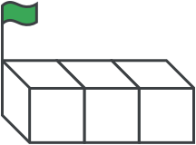
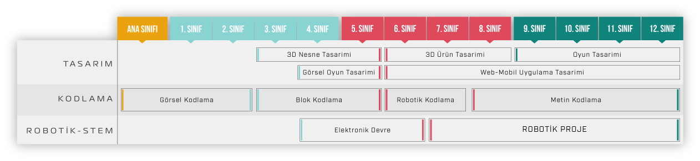

<h1 align="center">8-14 Yaş Grubundaki Çocuklar İçin Kodlama </h1>
<h1 align="center">SCRATCH ve mBLOCK </h1>

## Giriş

Pandemi döneminden önce 8-12 yaş aralığındaki üç farklı grupla yaptığımız kodlama çalışmaları ve içerikleri burada paylaşılmıştır.

Yararlanılan müfredatlar açık kaynak olup ingilizceden çeviri yapılmış ve yaş gruplarına uygun olacak şekilde tekrar düzenlenerek slaytlar ile desteklenmiştir.

Resim: Yaşlara göre STEM çalışmaları.

İlkokul yaş grubundaki çocukların dünya ile entegrasyon açısından özellikle Google CS FIRST sayfasında bulunan örnekler dikkatle incelenerek düzenlenmiştir. Bu yaş aralığındaki çocukların heyacanları ve öğrenme istekleri beni derinden etkilemiştir.

Biraz daha ileri seiyede block kodlama ile donanım uygulamaları için mBlock ve arduino seçilerek örnek uygulamalar yapılmıştır. Bu aşamada robotik kodlamaya da geçilebilir.

Bizim tarafımızdan geliştirilen uyuglamalar test edilimiş çalışmaktadır. Örnek olarak koyduğumuz uygulamalrın çoğu test edilmiştir. Fakat kontrol edemediklerimiz de olabilir.

Umarım ilgilenenlere faydalı olur...

## İletişim

- GitHub [@your-ilyas9461](https://github.com/ilyas9461)
- Linkedin [@your-linkedin](https://www.linkedin.com/in/ilyas-yagcioglu/)
